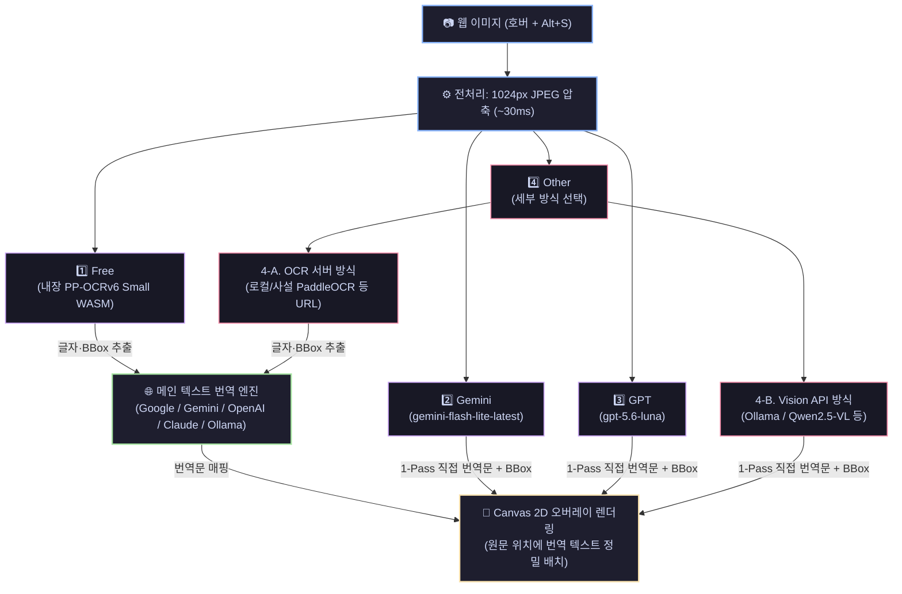
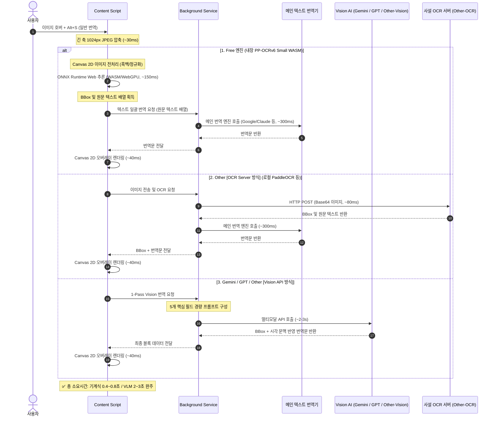
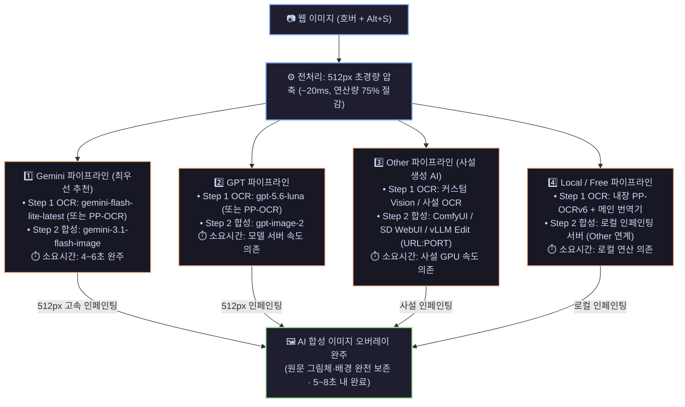
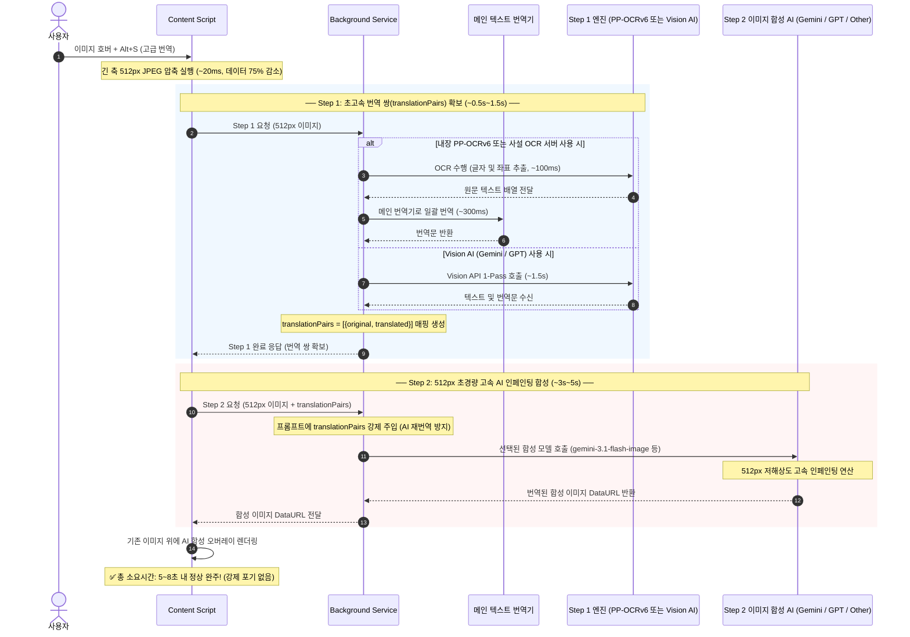

# 이미지 번역 아키텍처 및 고속 완주 파이프라인 상세 설계서 (v10)

## 1. 개요 및 핵심 원칙

1. **완주 보장 (강제 포기 금지)**:
   - 10초 제한은 "중간에 취소하여 비용을 낭비하고 Canvas로 때우는 방식"이 아닙니다.
   - **512px 압축(데이터 75% 감소) 및 경량 파이프라인으로 10초 이내(평균 5~8초)에 AI 이미지 합성을 실제로 완주**시키는 것이 엔지니어링 목표입니다.
   - 중간 강제 취소는 없으며, 정상적으로 끝까지 합성 이미지를 수신하여 표시합니다.
2. **무료 OCR 엔진 고도화**:
   - Tesseract의 CJK 한계(20~40%)를 극복하기 위해 **PP-OCRv6 Small (50개 언어 통합, CJK 95%+)** WASM 내장 및 **로컬/원격 PaddleOCR Server** 연동 지원.
   - Canvas 2D 기반 전처리로 과거 1.0의 메모리 누수를 원천 차단.
3. **2026년 최신 모델 명칭 및 동적 별칭(Dynamic Alias) 적용**:
   - Gemini: `gemini-flash-lite-latest` (항상 최신 Flash-Lite 유지, 초고속/무료 티어 최적)
   - OpenAI: `gpt-5.6-luna` (2026 최신 고속·경량 모델), 합성: `gpt-image-2`
   - Claude: `claude-3-5-haiku-latest` (항상 최신 Haiku 유지)
   - 코드 내 하드코딩을 배제하고 사용자가 직접 텍스트로 자유롭게 변경 가능하도록 Datalist 체계 제공.
4. **일반 / 고급 번역 엔진 및 모델 완전 독립 분리**:
   - 일반 모드: `Free (내장 PP-OCRv6 Small)`, `Gemini`, `GPT`, `Other`
   - 고급 모드: `Gemini`, `GPT`, `Other` (Step 1 OCR 모델과 Step 2 합성 모델 독립 입력)
5. **Other 엔진의 역할별 이원화 분리**:
   - 일반 번역용 Other: 단순 OCR 및 텍스트/좌표 추출 서버 (PaddleOCR REST API 등 URL:PORT)
   - 고급 번역용 Other: 이미지 생성 / 인페인팅 전용 서버 (ComfyUI, SD WebUI, OpenAI Edit 등 URL:PORT)
6. **메인 텍스트 번역 모델과의 비파괴적 분리 및 파일 계층 격리 원칙 (Non-destructive Isolation)**:
   - 기존 텍스트 번역 코드(`translationService.js`, `translation.js`, `api/*` 등)는 수정 0%로 불변 유지.
   - 기존 `src/api/` 루트에 뒤섞여 있던 `vision.js`와 `imageTranslate.js`를 신규 모듈과 함께 **`src/api/image/` 전용 하위 디렉토리로 이동·일원화**하여 메인 텍스트 API와의 혼선을 원천 차단.
   - 대용량 ONNX 모델 파일(~18MB)은 소스코드 폴더와 분리하여 **`src/models/`**에 독립 배치하고 `manifest.json`의 `web_accessible_resources`에 등록.

---

## 2. 일반 번역 (Standard Mode)

### A. 일반 번역 엔진 4종 구조도

> **선택 단위 4종**: `Free` / `Gemini` / `GPT` / `Other`  
> `Other` 선택 시 내부적으로 **OCR 서버** 방식과 **Vision API** 방식 중 하나를 추가 선택함 (합계 5개 실행 경로, 4개 엔진 진입점).



---

### B. 일반 번역 파이프라인 시퀀스 다이어그램



---

## 3. 고급 번역 (Premium Mode)

### A. 고급 번역 엔진 4종 구조도



---

### B. 고급 번역 파이프라인 시퀀스 다이어그램 (512px 고속 완주)



---

## 4. 최종 옵션 스토리지 스키마 (`src/options/storage.js`)

```javascript
export const DEFAULT_SETTINGS = {
  // ── 메인 텍스트 번역 설정 ──
  translationMode: "google",                  // "google" | "gemini" | "openai" | "claude" | "ollama" | "libre" | "custom"
  geminiApiKey: "",
  geminiModel: "gemini-flash-lite-latest",     // 항상 최신 Flash-Lite 유지
  openaiApiKey: "",
  openaiModel: "gpt-5.6-luna",                 // 2026 최신 고속·경량 모델
  claudeApiKey: "",
  claudeModel: "claude-3-5-haiku-latest",      // 항상 최신 Haiku 유지
  targetLang: "ko",

  // ── v2.0 이미지 번역 공통 설정 ──
  imageMode: "ask",                           // "ask" | "standard" | "premium"
  imageCostNotify: true,

  // ── 1. 일반 번역 (Standard: 단순 OCR + 번역) ──
  imageStdEngine: "free",                     // "free" | "gemini" | "openai" | "other"
  imageStdGeminiModel: "gemini-flash-lite-latest",
  imageStdOpenAIModel: "gpt-5.6-luna",
  // [일반용 Other: 전용 OCR / Vision 서버]
  imageStdOtherType: "ocr_server",            // "ocr_server" (Paddle 등) | "vision_api" (Qwen 등)
  imageStdOtherUrl: "http://localhost:8000/predict",
  imageStdOtherKey: "",
  imageStdOtherModel: "qwen2.5-vl",

  // ── 2. 고급 번역 (Premium: 이미지 생성 기반 번역) ──
  imagePremEngine: "gemini",                  // "gemini" | "openai" | "other"
  // [Gemini 고급]
  imagePremGeminiOcrModel: "gemini-flash-lite-latest",
  imagePremGeminiSynthModel: "gemini-3.1-flash-image",
  // [OpenAI 고급]
  imagePremOpenAIOcrModel: "gpt-5.6-luna",
  imagePremOpenAISynthModel: "gpt-image-2",   // OpenAI 공식 이미지 생성 모델
  // [고급용 Other: 사설 이미지 생성 / 인페인팅 전용 서버]
  imagePremOtherUrl: "http://localhost:7860", // ComfyUI / SD WebUI / OpenAI Edit 규격
  imagePremOtherKey: "",
  imagePremOtherOcrModel: "qwen2.5-vl",
  imagePremOtherSynthModel: "sd_inpainting_model",
};
```

---

## 5. 상세 구현 계획

### 1단계: 모델 명칭 하드코딩 제거 및 `storage.js` / 옵션 UI 전면 개편
- `src/options/storage.js`: 상기 `DEFAULT_SETTINGS` 스키마 반영.
- `src/options/options.html` & `src/options/index.js`:
  - 일반 번역 엔진 4종 탭: `Free (내장 PP-OCR)`, `Gemini`, `GPT`, `Other`
  - **일반 Other 탭**:
    - 라디오: `[●] 전용 OCR 서버 HTTP (PaddleOCR 등)` / `[○] OpenAI 규격 Vision API (Qwen2.5-VL 등)`
    - URL(`imageStdOtherUrl`), Key(`imageStdOtherKey`), Model(`imageStdOtherModel`)
  - 고급 번역 엔진 3종 탭: `Gemini`, `GPT`, `Other`
  - **고급 Other 탭**:
    - 사설 이미지 생성/인페인팅 서버 URL(`imagePremOtherUrl`), Key(`imagePremOtherKey`), 모델명 입력 필드
  - 각 모델명 입력칸에 `<datalist>` 추천 목록 제공 및 자유 타이핑 지원.

### 2단계: PP-OCRv6 Small WASM 모듈 및 Other OCR 서버 통신 모듈 구축 (격리 배치)
- `src/api/image/paddleOcrWeb.js` (신규 격리 모듈):
  - `onnxruntime-web` 기반 PP-OCRv6 Small WASM 로더.
  - 브라우저 Canvas 2D 기반 이미지 리사이즈 및 정규화 (OpenCV 완전 배제).
  - 텍스트 및 BBox 추출 후, Background의 `handleTranslation()`(메인 번역기)으로 텍스트 일괄 전달.
- `src/api/image/customOcrServer.js` (신규 격리 모듈):
  - `imageStdOtherUrl`로 이미지 전송 후 `{ text, bbox }` 정규화 수신 → 메인 번역기 연동.

### 3단계: Vision API (Gemini/GPT/Other) 최신화 및 Background 라우팅
- `src/api/vision.js` (또는 `src/api/image/vision.js` 통합):
  - 메인 텍스트 API와 분리된 전용 Vision 1-Pass 모듈.
  - 하드코딩 제거, 사용자가 입력한 모델명 최우선 적용.
  - 5개 핵심 필드 경량 프롬프트 적용 (토큰 60% 절감, 2초대 응답).
  - `Other [Vision API]` 요청 처리 라우팅.
- `src/background/imageService.js`:
  - 일반 번역 엔진 라우팅 (`free`, `gemini`, `openai`, `other_ocr`, `other_vision`).
  - 고급 번역 Step 1(번역 쌍 확보)과 Step 2(합성) 분리 실행.
  - 메인 `translationService.js`는 일체 수정하지 않고 클라이언트로서만 호출.

### 4단계: Content Script 512px 압축 및 고속 완주 파이프라인 검증
- `src/content/image/index.js`:
  - 고급 모드 진입 시 긴 축 512px 압축 적용 (데이터 75% 감소).
  - 도중 작업 캔슬 없이 5~8초 내에 온전한 AI 합성 이미지 완주 표시.
  - ms 타이밍 로깅 유지.

---

## 6. 기존 구조 수정 및 하위 호환성 개선 사항 (Refactoring & Migration)

기존 코드베이스에서 신규 아키텍처로 전환하면서 반드시 수정·보완해야 할 5가지 핵심 사항입니다:

### 1) 스토리지 하위 호환 마이그레이션 (`storage.js`, `options/index.js`)
- **문제**: 기존 사용자의 스토리지에 `imageTransMode`, `premiumGeminiModel` 등 구버전 키가 저장되어 있어 설정 유실 위험이 있음.
- **개선**: `getSettings()` 호출 시 구버전 키가 감지되면 신규 키(`imageMode`, `imagePremGeminiSynthModel` 등)로 자동 매핑·폴백하여 마이그레이션을 무중단 보장.

### 2) 512px/1024px 압축에 따른 BBox 좌표 스케일 정합성 보장 (`content/image/index.js`, `canvasRenderer.js`)
- **문제**: 이미지를 512px 또는 1024px로 압축하여 OCR을 수행할 때, 절대 픽셀 좌표가 반환되면 원본 크기(`naturalWidth/Height`)와 불일치 발생.
- **개선**:
  - Gemini/GPT의 0~1000 정규화 비율 좌표는 그대로 유지.
  - 내장 PP-OCRv6 및 사설 OCR 서버가 압축된 픽셀 좌표를 반환할 경우, 원본 해상도 대비 스케일 팩터(`scaleX = naturalWidth / compressedWidth`)를 즉시 곱하여 원본 픽셀 좌표로 완벽 역정규화.

### 3) Background 일반 번역 파이프라인 분기 체계 신설 (`imageService.js`)
- **문제**: 기존 `handleStandardTranslation()`이 `translateImageWithVision()`(Gemini/OpenAI)에만 단일 결합되어 있음.
- **개선**:
  - `imageStdEngine` 설정에 따라:
    - `free` / `other_ocr`일 때: OCR 추출 텍스트를 메인 번역기(`handleTranslation()`)로 일괄 전달하여 번역문 결합.
    - `gemini` / `openai` / `other_vision`일 때: 1-Pass 경량 Vision API 호출.

### 4) Vision API 프롬프트 경량화 및 하드코딩 완전 제거 (`vision.js`)
- **문제**: `gemini-3.6-flash`, `gpt-4o-mini`가 기본값으로 강제 고정되어 있고, 11개 필드 반환으로 응답 지연 발생.
- **개선**:
  - 하드코딩을 제거하고 사용자가 지정한 최신 모델명(`gemini-flash-lite-latest`, `gpt-5.6-luna`) 우선 적용.
  - 프롬프트 반환 필드를 **5개 핵심 필드(`eraseBox`, `originalText`, `translatedText`, `orientation`, `textColor`)**로 압축하여 출력 토큰 60% 절감 및 2초대 응답 달성.

### 5) 옵션 UI의 일반 번역 엔진 제어 카드 신설 (`options.html`, `options/index.js`)
- **문제**: 기존 옵션 페이지에는 고급 모드 설정만 있고, 일반 모드 엔진(Free, Gemini, GPT, Other)을 선택하는 UI가 완전히 누락되어 있음.
- **개선**:
  - 일반 번역 엔진 4종 탭 및 Other 전용 세부 설정 폼을 신설하여 일반/고급 모드를 완벽히 분리 제어.

---

## 7. 메인 번역 시스템과의 상호 운용성 및 공용 인프라 개선 (Main System Interoperability)

이미지 번역 기능을 구축하면서 기존 메인 텍스트 번역 시스템과 공유·개선하여 상호 시너지를 극대화하는 5가지 사항입니다:

### 1) 사용자 사전(단어장, `customDict`) 공용 적용
- **개선**: 기존 메인 텍스트 번역(`translation.js`)의 `applyLocalDictionary` 로직을 공용 유틸(`src/utils/dictionary.js`)로 분리.
- **효과**: 웹툰·만화·게임 이미지에 자주 등장하는 캐릭터 이름, 고유명사, 기술 용어가 OCR/VLM 번역 텍스트에도 100% 동일하게 치환 적용되어 번역 일관성 달성.

### 2) 텍스트 번역 캐시 시스템 연동 (0ms 체감 속도)
- **개선**: 기계식 OCR(PP-OCRv6 / Paddle Server)로 추출된 문장 배열에 대해 메인 텍스트 번역 캐시(`getCache`)를 선조회.
- **효과**: 이미 웹페이지나 이전 번역에서 처리된 적이 있는 문장은 외부 API 호출 없이 즉시 0ms로 번역문 매핑.

### 3) OCR 텍스트 정규화 전처리 유틸리티 (`cleanOcrTextForTranslation`)
- **개선**: OCR 엔진이 추출한 원문 텍스트의 불필요한 연속 개행(`\n`), 전각/반각 공백, 말풍선 특수기호를 정제하는 공용 필터 적용.
- **효과**: 메인 번역 엔진(Google, Claude, DeepL 등)에 정돈된 문장이 전달되어 번역 품질과 어색한 어순 문제 해결.

### 4) 백그라운드 번역 호출 인터페이스 간소화 (`translationService.js`)
- **개선**: `translationService.js`에 스토리지 설정 객체를 직접 전달받아 처리하는 헬퍼 인터페이스 `translateTextArray(texts, settings)` 신설.
- **효과**: `imageService.js`에서 텍스트 번역 위임 시 수십 개의 인자를 개별 분해하지 않고 깔끔하게 1줄 호출 가능.

### 5) 메인 번역 엔진 기본 모델명 전면 동기화
- **개선**: 메인 텍스트 번역 기본 모델명을 2026 최신 라인업으로 일괄 동기화.
  - Gemini: `gemini-flash-lite-latest` (항상 최신 Flash-Lite 유지)
  - OpenAI: `gpt-5.6-luna` (2026 최신 고속·경량 모델)
  - Claude: `claude-3-5-haiku-latest` (항상 최신 Haiku 유지)

---

## 8. 검증 계획
1. **일반 번역 4종 엔진 검증**:
   - `Free` & `Other [OCR Server]`: BBox 추출 후 메인 번역기 연동(0.4~0.8초 완료) 확인.
   - `Gemini` & `GPT` & `Other [Vision API]`: 시각 문맥 1-Pass 직접 번역(2~3초 완료) 확인.
2. **고급 번역 512px 완주 검증**:
   - 512px 압축 적용 및 Step 1(0.5~1.5초) → Step 2(3~5초) = 총 5~8초 완주 확인.
3. **단어장(`customDict`) 및 캐시 연동 검증**:
   - 이미지 내 텍스트에 사용자 사전 단어가 등록되어 있을 때 정상 치환되는지 확인.
4. **스토리지 마이그레이션 검증**:
   - 기존 버전 키가 신규 스키마 키로 정상 승계되는지 확인.
5. **빌드 검증**: `npm run package` 실행을 통한 문법 검사 및 크롬 확장 패키징 무결성 확인.

---

## 9. AI 모델별 실행 지시서 및 최적화 배치 로드맵 (Actionable Execution Roadmap)

본 절은 사용자가 AI 모델(Gemini, Claude 등)에게 단계별로 프롬프트를 즉시 복사하여 지시할 수 있도록 완결된 작업 단위로 묶은 최적화 실행 지시서입니다.

---

### 📦 [BATCH 1] 스토리지 개편 및 옵션 UI 전면 구축
> **권장 실행 모델**: **Gemini 3.8 Flash (High)**  
> **작업 목적**: 신규 스토리지 스키마 구축, 구버전 마이그레이션, 일반 4종/고급 3종 탭 UI 완결

#### 작업 지시 명세:
1. **`src/options/storage.js` 수정**:
   - `DEFAULT_SETTINGS`에 `imageStd*`, `imagePrem*` 스키마 14개 필드 반영 (제4절 스키마 참조).
   - 메인 번역 모델 기본값을 `gemini-flash-lite-latest`, `gpt-5.6-luna`, `claude-3-5-haiku-latest`로 최신화.
   - `getSettings()` 내부에 구버전 키(`imageTransMode`, `premiumGeminiModel` 등) 감지 시 신규 키로 자동 매핑·폴백하는 마이그레이션 로직 추가.
2. **`src/options/options.html` 수정**:
   - 기존 이미지 번역 섹션을 **[일반 번역 엔진 4종]**과 **[고급 번역 엔진 3종]** 카드로 분리.
   - 일반 번역: `Free (내장 PP-OCR)`, `Gemini`, `GPT`, `Other` 라디오 탭 생성.
   - 일반 Other 세부 설정: `[●] 전용 OCR 서버` / `[○] OpenAI 규격 Vision API` 라디오 및 URL/Key/Model 입력 폼 추가.
   - 고급 번역: `Gemini`, `GPT`, `Other` 라디오 탭 및 Step 1 OCR / Step 2 합성 모델 입력 폼 추가.
   - 각 모델 입력칸에 최신 모델명을 제공하는 `<datalist>` 추천 콤보박스 연결.
3. **`src/options/index.js` 수정**:
   - 신규 폼 요소 DOM 바인딩 및 라디오 전환 시 해당 설정 섹션 표시/숨김 처리.
   - `saveSettings` 시 신규 스키마 객체 정상 저장 처리 및 유효성 검증.
4. **검증**: `npm run package` 실행하여 문법 오류 0건 확인.

---

### 📦 [BATCH 2] 백그라운드 라우팅 및 메인 번역 상호 운용성 구축
> **권장 실행 모델**: **Gemini 3.8 Flash (High)** 또는 **Claude Sonnet 4.6**  
> **작업 목적**: 이미지 API 일원화 이동, 사설 OCR 서버 통신, 메인 번역기 단어장/캐시 연동, Vision 1-Pass 경량화

#### 작업 지시 명세:
1. **이미지 API 전용 디렉토리 격리 (`src/api/image/` 일원화)**:
   - `src/api/vision.js` ➡️ **`src/api/image/vision.js`**로 이동.
   - `src/api/imageTranslate.js` ➡️ **`src/api/image/imageTranslate.js`**로 이동.
   - `src/background/imageService.js` 내부의 import 경로를 `../api/image/...`로 수정.
2. **`src/utils/dictionary.js` 신설**:
   - 기존 `translation.js`의 `applyLocalDictionary(text, dict)` 로직을 공용 유틸로 분리 export.
3. **`src/utils/cleaner.js` 신설**:
   - `cleanOcrTextForTranslation(text)` 함수 작성: OCR 추출 텍스트의 불필요한 개행, 연속 공백, 전각 기호 정제.
4. **`src/background/translationService.js` 수정**:
   - `translateTextArray(texts, settings)` 헬퍼 함수 신설 (스토리지 객체를 받아 메인 번역기로 텍스트 배열 일괄 번역).
5. **`src/api/image/customOcrServer.js` 신설 (격리 디렉토리)**:
   - `imageStdOtherUrl` 엔드포인트로 이미지 Base64를 POST 전송하여 PaddleOCR REST 규격의 `{ text, bbox }`를 파싱·정규화하여 반환.
6. **`src/api/image/vision.js` 수정**:
   - 모델명 하드코딩 제거, 사용자가 전달한 모델명 우선 적용.
   - 프롬프트 반환 필드를 5개(`eraseBox`, `originalText`, `translatedText`, `orientation`, `textColor`)로 경량화.
7. **`src/background/imageService.js` 수정**:
   - `handleStandardTranslation`: `imageStdEngine` 설정에 따라:
     - `free` / `other_ocr`: OCR 텍스트 추출 → `translateTextArray()`로 메인 번역기 연동 → 블록 합성.
     - `gemini` / `openai` / `other_vision`: 경량 `translateImageWithVision()` 1-Pass 호출.
   - `handlePremiumTranslation`: Step 1(번역 쌍 확보)과 Step 2(합성) 분리 실행 및 지정 모델 바인딩:
     - **Gemini**: Step 1 모델 ← `imagePremGeminiOcrModel`, Step 2 모델 ← `imagePremGeminiSynthModel`
     - **GPT**: Step 1 모델 ← `imagePremOpenAIOcrModel`, Step 2 모델 ← `imagePremOpenAISynthModel`
     - **Other**: Step 1 모델 ← `imagePremOtherOcrModel`, Step 2 모델 ← `imagePremOtherSynthModel`, 서버 URL ← `imagePremOtherUrl`, API Key ← `imagePremOtherKey`
     - ⚠️ 고급 Other의 Step 1/Step 2 모델명 바인딩은 스키마에 선언된 `imagePremOtherOcrModel` / `imagePremOtherSynthModel` 두 필드를 반드시 분리하여 각각 주입할 것 (단일 모델 필드로 합치지 않음).
8. **검증**: `npm run package` 실행하여 패키징 검증.

---

### 📦 [BATCH 3] 고정밀 좌표 스케일러 & PP-OCRv6 WASM 텐서 엔진 구축
> **권장 실행 모델**: **Claude Opus 4.6 (Thinking)** 🔥  
> **작업 목적**: 512px 압축 좌표 역정규화 보정, 순수 JS DBNet 후처리 알고리즘 및 ONNX 로더 완결

#### 작업 지시 명세:
1. **모델 격리 디렉토리 신설 및 Manifest 등록**:
   - `src/models/` 디렉토리 신설 및 `pp-ocrv6-small.onnx` (~18MB) 배치.
   - `manifest.json`의 `web_accessible_resources`에 `"src/models/*"` 추가 등록.
   - ⚠️ **빌드 스크립트 복사 포함 확인**: `package.json`의 `npm run package` 스크립트(또는 webpack/rollup 설정)가 `src/models/**` glob을 빌드 출력 디렉토리에 복사하는지 반드시 확인. 누락 시 확장 프로그램 패키지에 ONNX 파일이 포함되지 않아 런타임 로드 실패가 발생함.
   - ⚠️ **content script ES Module 타입 확인**: `canvasRenderer.js`에서 `src/utils/dictionary.js`를 ES Module `import`로 사용하려면 `manifest.json`의 `content_scripts` 항목에 `"type": "module"` 선언이 필요한지 MV3 사양을 기준으로 확인. 필요 시 해당 content script를 module 타입으로 전환하거나 번들러 처리를 통해 단일 파일로 합성.
2. **`src/content/image/index.js` 수정**:
   - `compressBase64ForOcr(dataUrl, width, height, mode)`에 `mode === "premium"` 분기 추가하여 긴 축 **512px** 압축.
   - 일반 모드(`mode === "standard"`)는 1024px 유지.
   - 기계식 OCR(절대 픽셀 좌표) 수신 시 원본 해상도 대비 스케일 팩터(`scaleX = naturalWidth / compressedWidth`, `scaleY = naturalHeight / compressedHeight`)를 곱하여 원본 이미지 기준 좌표로 정밀 역정규화.
3. **`src/content/image/canvasRenderer.js` 수정**:
   - `src/utils/dictionary.js`의 `applyLocalDictionary`를 import하여 렌더링 직전 번역 텍스트에 사용자 사전 최종 치환 적용.
   - 5개 경량 필드(`eraseBox`, `originalText`, `translatedText`, `orientation`, `textColor`) 기반 완벽 렌더링.
4. **`src/api/image/paddleOcrWeb.js` 신설 (가장 고난도 알고리즘)**:
   - `chrome.runtime.getURL("src/models/pp-ocrv6-small.onnx")` 경로로부터 `onnxruntime-web` WASM 로더 및 WebGPU/WASM 세션 초기화.
   - 브라우저 Canvas 2D 기반 이미지 RGB 정규화 (Mean: [0.485, 0.456, 0.406], Std: [0.229, 0.224, 0.225]) 및 텐서 생성 (`opencv.js` 완전 배제).
   - **DBNet 후처리 알고리즘 (순수 바닐라 JS 구현)**:
     - Probability Map에 threshold(0.3) 적용하여 이진 비트맵 생성.
     - 순수 JS 8-방향 외곽선(Contour) 추적 알고리즘 구현.
     - Vatti 알고리즘 기반 Unclip ratio(1.5~2.0) 폴리곤 확장 연산.
     - 최소 면적 외접 회전 사각형(Minimum Area Bounding Box) 추출 및 쿼드 좌표 복원.
   - Recognition 모델 추론 및 CTC Greedy Decoder로 텍스트 디코딩.
   - 추출된 `{ text, bbox }` 배열을 반환.
5. **최종 통합 검증**:
   - Pixiv 및 일반 웹 이미지에서 일반 모드(Free, Other, Gemini, GPT) 및 고급 모드(512px 완주) 전수 테스트.
   - `npm run package` 빌드 및 콘솔 에러 0건 확인.

---

## 10. 코드베이스 정밀 정리 지침: 보존·제거·더미 파일 처리 (Codebase Clean-up & Retention Policy)

본 절은 구현 과정에서 어떤 코드를 반드시 보존하고, 어떤 코드를 폐기하며, 어떤 더미 파일을 정리해야 하는지에 대한 엄격한 지침입니다.

### 🛡️ 1. 보존 대상 (수정 0% 원칙 유지)
다음 자산들은 수많은 검증을 통과한 핵심 로직이므로 **일체 수정하지 않고 그대로 유지**합니다:
- **메인 텍스트 번역 코어 전체**:
  - `src/content/index.js`, `translation.js`, `dom.js`, `observer.js`, `ui.js`, `state.js`
  - `src/api/`의 텍스트 번역 모듈 (`google.js`, `gemini.js`, `openai.js`, `claude.js`, `ollama.js`, `libre.js`, `custom.js`)
- **이미지 번역의 검증된 UI 및 렌더링 자산**:
  - `src/content/image/hoverManager.js`: 마우스 호버 감지, 50px 미만 필터링, 디바운스, 플로팅 버튼 생성 (수정 0%)
  - `src/content/image/modeDialog.js`: 일반/고급 번역 선택 모달 UI (수정 0%)
  - `src/content/image/overlayManager.js`: Absolute Canvas 오버레이 및 원본/번역 토글 컨트롤러 (수정 0%)
  - `src/background/imageService.js` 내 `fetchImageAsBase64()`: Pixiv Referer 우회 및 다운로드 로직 (수정 0%)
  - `src/api/imageTranslate.js` (이동 후 `src/api/image/imageTranslate.js`) 내 `buildWebtoonPrompt()`: 화풍 보존 프롬프트 (수정 0%)

---

### 🗑️ 2. 제거 대상 (Dead Code & Tech Debt 제거)
다음 레거시 코드들은 코드베이스 오염과 지연을 방지하기 위해 **구현 과정에서 즉시 삭제**합니다:
1. **미사용 Import 제거 (`vision.js`)**:
   - 1-Pass 통합으로 더 이상 사용되지 않는 `import { translateWithOpenAI, translateWithGemini }` 선언 삭제.
2. **과다 프롬프트 필드 제거 (`vision.js`)**:
   - 렌더러에서 사용하지 않는 `glyphBox`, `containerBox`, `lines[]`, `strokeColor` 지침 및 스키마 필드 완전 제거 (토큰 절감).
3. **구형 모델 하드코딩 Fallback 제거 (`vision.js`)**:
   - `geminiModel || "gemini-3.6-flash"`, `openaiModel || "gpt-4o-mini"` 하드코딩 기본값을 제거하고 상위 스토리지 주입값 사용.
4. **구버전 스토리지 평면 키 선언 제거 (`storage.js`)**:
   - `DEFAULT_SETTINGS`에서 `imageTransMode`, `imageTransPremiumEngine`, `imageTransPremiumModel`, `premiumGeminiModel`, `premiumOpenAIModel` 선언 삭제 (단, `getSettings()`의 마이그레이션 맵으로만 유지).
5. **낙관적 업데이트 잔재 및 임시 디버그 플래그 (`content/image/index.js`)**:
   - 이전 세션의 미완성 낙관적 업데이트 관련 잔재 로직 정리.

---

### 🧹 3. 더미 파일 및 이동 후 잔여 파일 정리 (File Cleanup)
1. **이동 후 루트 잔여 파일 삭제**:
   - `src/api/vision.js` ➡️ `src/api/image/vision.js` 이동 완료 즉시, 기존 `src/api/vision.js` 원본 파일 삭제.
   - `src/api/imageTranslate.js` ➡️ `src/api/image/imageTranslate.js` 이동 완료 즉시, 기존 `src/api/imageTranslate.js` 원본 파일 삭제.
   - 중복 파일로 인한 import 혼선 원천 차단.
2. **바이너리/빌드 더미 방지**:
   - `.gitignore`에 등록된 `*.exe`, `*.dll`, `*.bin`, `Build/temp_build`가 git 스테이징에 절대 포함되지 않도록 유지.


